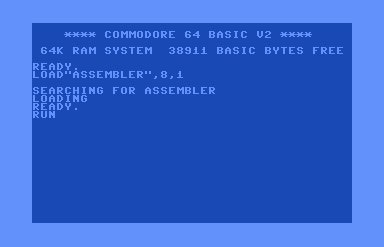
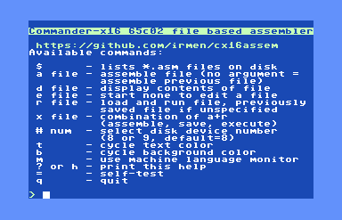
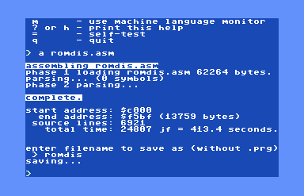

# c64assem

This is the binary release of a Commodore 64 port of the cx16assem file based assembler by Irmen de Jong. This **requires** a RAM Expansion Unit (REU).  Minimum of 256KB is recommended for larger files, but a 128KB REU works.

The source code is on the [c64 branch][1] of [my fork][2] of the [cx16assem repository][3]. It uses my [prog8reu][4] module which provides REU support under [Prog8][5] with some Commander X16 RAM banking compatibility.

Eventually there will be some [examples](examples) and [documentation](docs) available.  Currently these are just placeholders.

The binary is `assembler.prg` in this repository.

# c128assem

Ok, I added a version for the Commodore 128 as well.  It needs more testing but has been able to compile the same large files tested with c64assem.  The binary is `assembler128.prg` in this repository.

The source code is on the [c128 branch][6] of the repository mentioned above.

# Usage

This is a file based assembler and it can be loaded and run like any other C64 program. Note it is called `assembler.prg` in this repository, but you might want to rename it to just `assembler` on your C64 storage device as in the image below.

Once run you will be presented with a menu and a command line where you can provide commands and arguments.

The commands are self-explanatory though some of them are disabled, like the machine language monitor. To assemble a source code file use the `a` command followed by the filename.  If it assembles without an error you will be asked for an output filename.  In the example below I assemble `romdis.asm` using the command `a romdis.asm` and then provide an output filename of `romdis` after successful assembly.

# Performance

Currently the assembler is very slow.  One reason is straight-forward; the Commodore 64 only runs at 1Mhz versus the 8Mhz of the Commander X16. Right there that will make it take roughly 8 times as long as the Commander X16.  Another reason is the storage on a C64 is significantly slower than the SD card on the X16.  Reading and writing large files from slow devices, or emulated devices is going to take much longer.  These two are inherent to the C64 and not much can be done.  Faster storage (like an IDE64 or RAMLink, or 1541 Ultimate II+ with the HyperSpeed kernal) can improve the situation. Also accelerators like the SuperCPU, Turbo Chameleon 64, or Ultimate 64 should be able to speed it up dramatically.  This needs to be tested.

Finally there is an architectural element that is causing significant performance impact that can be improved by reworking the code.  For this initial port I attempted to get it running with as few changes as possible.

The main architectural issue is that while the Commander X16 RAM banking is done in hardware and is done by the time the instruction to change the bank is finished executing, on the C64 with REU there is a significant amount of clock cycles required to change banks.  

Currently the `output.emit()` routine switches between the active source code bank and active output bank for each output byte. Switching banks on the C64 with the REU involves stashing the current 8KB bank in the REU and fetching the requested 8KB bank from the REU.  This means for each bank switch 16KB of data is moved.  The REU does this with its DMA engine at 1 byte per clock cycle, but it still takes roughly 16384 cycles. Plus the code that sets up the bank switching commands for the REU which has to calculate the correct offsets.

Doing this bank switch for *each byte* is of course terribly inefficient on the C64 while it is just one instruction on the X16 and just a few clock cycles at 8Mhz. Again this initial work was focused on the fewest changes to get it working. Next will be refactoring the `output.emit()` routine to likely use a small output buffer in main RAM to reduce the amount of bank switching.  A 1KB buffer would reduce bank switching roughly 1000X at the cost of some buffer management and copying the full buffer to the bank RAM area every 1000+ output bytes.

Using the REU DMA engine to move a 1KB buffer would be extremely fast, but requires additional routines to support arbitrary copying to offsets inside logical banks.  That will be a future optimization that can be made.  Initially a simple buffer that is copying by the CPU to the correct spot in the banked memory will be a significant improvement without deviating too much from compatibility with the X16 banking.  And a cpu based `memcopy()` can be easily replaced with a REU accelerated one in the the future.

# TODO
- Improve `output.emit()` as described above
- Cleanup disabled functions like the monitor or make them actually work.
- Provide better documentation than this README
- Provide some working examples showing all of the features / syntax supported.

Feedback is appreciated and feel free to create issues or contact me via C64 OS or Commander X16 Discord.

[1]: https://github.com/gillham/cx16assem/tree/c64
[2]: https://github.com/gillham/cx16assem
[3]: https://github.com/irmen/cx16assem
[4]: https://github.com/gillham/prog8reu
[5]: https://github.com/irmen/prog8
[6]: https://github.com/gillham/cx16assem/tree/c128

